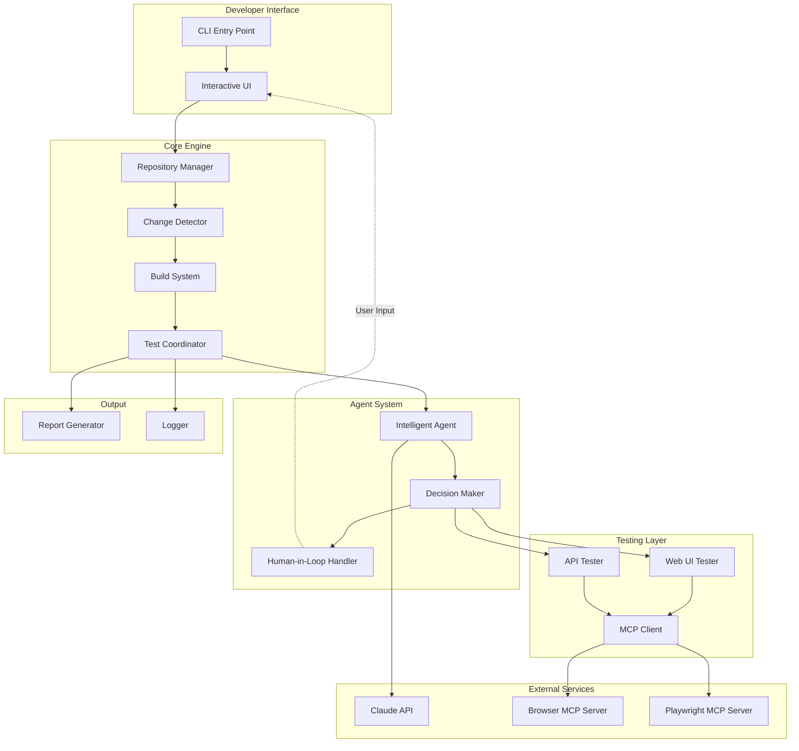
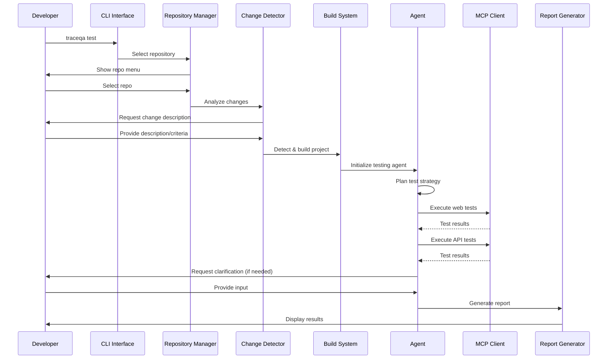
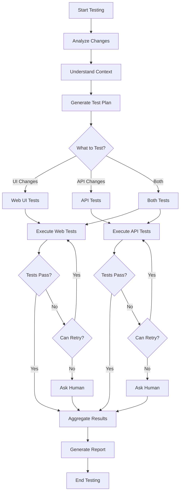
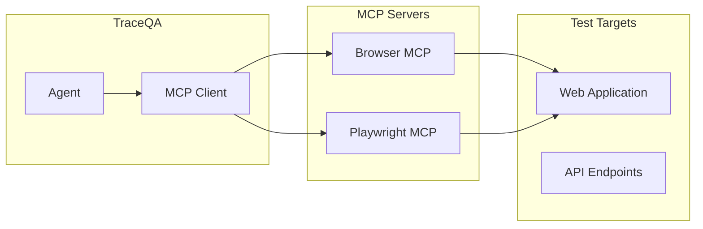
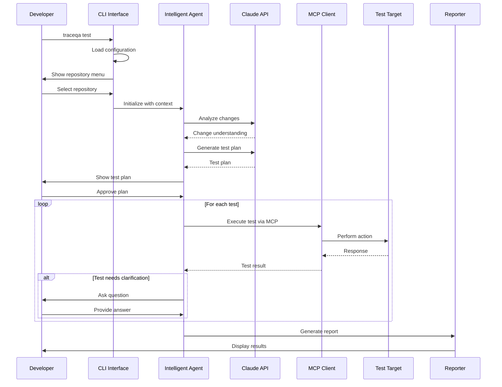

# TraceQA - Technical Specification

## Executive Summary

TraceQA is a developer-focused CLI tool that enables immediate testing of code changes before merging. It spawns an intelligent agent capable of testing features across web applications and APIs, providing fast feedback to developers in their workflow.

**Version:** 1.0.0  
**Last Updated:** 2026-05-01  
**Status:** Design Phase

---

## Table of Contents

1. [Core Concept](#core-concept)
2. [Technology Stack](#technology-stack)
3. [System Architecture](#system-architecture)
4. [CLI Framework & UX Design](#cli-framework--ux-design)
5. [Component Specifications](#component-specifications)
6. [Agent Workflow](#agent-workflow)
7. [MCP Integration Strategy](#mcp-integration-strategy)
8. [File Structure](#file-structure)
9. [Data Flow](#data-flow)
10. [Error Handling](#error-handling)
11. [Extensibility](#extensibility)
12. [Implementation Roadmap](#implementation-roadmap)

---

## Core Concept

TraceQA bridges the gap between code implementation and quality assurance by providing developers with an intelligent testing agent that can:

- Understand what changed in the codebase
- Automatically detect project type and build requirements
- Execute comprehensive tests across web UI and API layers
- Provide clear, actionable feedback
- Request human input when needed

**Key Principle:** Test early, test often, test intelligently.

---

## Technology Stack

### Recommended Stack

**Primary Language:** TypeScript (Node.js)

**Rationale:**
- Excellent CLI tooling ecosystem
- Strong typing for maintainability
- Native async/await support for agent operations
- Wide adoption in developer tools
- Easy integration with MCP servers
- Cross-platform compatibility

### Core Dependencies

```json
{
  "runtime": "Node.js >= 18.0.0",
  "language": "TypeScript 5.x",
  "cli-framework": "@clack/prompts",
  "agent-framework": "LangChain.js or custom",
  "llm-integration": "Anthropic Claude API",
  "mcp-client": "@modelcontextprotocol/sdk",
  "browser-automation": "Playwright (via MCP)",
  "api-testing": "axios + custom test runner",
  "git-operations": "simple-git",
  "build-detection": "custom detection logic",
  "config-management": "cosmiconfig",
  "logging": "winston",
  "reporting": "custom markdown generator"
}
```

---

## System Architecture

### High-Level Architecture



### Component Interaction Flow



---

## CLI Framework & UX Design

### Framework Selection: @clack/prompts

**Rationale:**
- Modern, beautiful CLI interface similar to ClaudeCode/OpenCode
- Excellent developer experience with personality
- Built-in spinners, progress bars, and interactive prompts
- TypeScript-first design
- Minimal dependencies
- Active maintenance

**Alternatives Considered:**
- **Ink (React for CLI):** Too heavy, slower startup time
- **Commander.js:** Traditional, lacks modern UX
- **Oclif:** Over-engineered for our needs

### UX Design Principles

1. **Conversational Flow:** Guide developers through the process naturally
2. **Visual Feedback:** Use spinners, progress bars, and colors effectively
3. **Personality:** Friendly but professional tone
4. **Speed:** Fast startup and responsive interactions
5. **Clarity:** Clear error messages and actionable feedback

### CLI Interface Examples

```typescript
// Welcome screen
┌  TraceQA - Intelligent Testing Agent
│
◇  What would you like to test?
│  ● Current repository changes
│  ○ Specific feature branch
│  ○ Custom test scenario
└

// Repository selection
◇  Select a repository to test:
│  ● my-web-app (c:/projects/my-web-app)
│  ○ api-service (c:/projects/api-service)
│  ○ mobile-app (c:/projects/mobile-app)
│  ○ Browse for another repository...
└

// Change description
◆  Describe what you changed (or provide acceptance criteria):
│  Added user authentication with JWT tokens
└

// Testing progress
◇  Building project...
│  ✓ Detected: React + TypeScript
│  ✓ Running: npm run build
│  ✓ Build completed in 12.3s
│
◇  Running tests...
│  ⠋ Testing login flow...
│  ⠋ Validating JWT token generation...
│  ⠋ Checking protected routes...
└

// Results
┌  Test Results
│
│  ✓ Login Flow (3/3 passed)
│    ✓ User can login with valid credentials
│    ✓ Invalid credentials show error message
│    ✓ JWT token is stored correctly
│
│  ✓ API Endpoints (2/2 passed)
│    ✓ POST /auth/login returns 200 with token
│    ✓ Protected routes require valid token
│
│  Summary: 5/5 tests passed ✓
│  Duration: 45.2s
└
```

---

## Component Specifications

### 1. CLI Entry Point

**File:** `src/cli/index.ts`

**Responsibilities:**
- Parse command-line arguments
- Initialize configuration
- Route to appropriate command handlers
- Handle global error catching

**Commands:**
```bash
traceqa test              # Interactive testing mode
traceqa test --repo PATH  # Test specific repository
traceqa test --branch NAME # Test specific branch
traceqa config            # Configure TraceQA
traceqa init              # Initialize TraceQA in project
traceqa --version         # Show version
traceqa --help            # Show help
```

### 2. Repository Manager

**File:** `src/core/repository-manager.ts`

**Responsibilities:**
- Discover Git repositories on the system
- Cache repository locations
- Validate repository state
- Switch between repositories

**Key Methods:**
```typescript
interface RepositoryManager {
  discoverRepositories(): Promise<Repository[]>;
  selectRepository(): Promise<Repository>;
  validateRepository(path: string): Promise<boolean>;
  getRepositoryInfo(path: string): Promise<RepositoryInfo>;
}
```

**Repository Discovery Strategy:**
1. Check recent repositories from config
2. Scan common project directories (~/projects, ~/code, etc.)
3. Allow manual path input
4. Cache discovered repositories for future use

### 3. Change Detector

**File:** `src/core/change-detector.ts`

**Responsibilities:**
- Detect uncommitted changes
- Analyze git diff
- Extract changed files and their context
- Generate change summary

**Key Methods:**
```typescript
interface ChangeDetector {
  detectChanges(repoPath: string): Promise<ChangeSet>;
  getChangedFiles(): Promise<FileChange[]>;
  generateChangeSummary(): Promise<string>;
  getGitDiff(options?: DiffOptions): Promise<string>;
}
```

### 4. Build System

**File:** `src/core/build-system.ts`

**Responsibilities:**
- Auto-detect project type
- Determine build commands
- Execute build process
- Validate build success

**Project Type Detection:**

```typescript
interface ProjectDetector {
  detectProjectType(path: string): Promise<ProjectType>;
  getBuildCommands(type: ProjectType): BuildCommands;
  executeBuild(commands: BuildCommands): Promise<BuildResult>;
}

enum ProjectType {
  REACT = 'react',
  VUE = 'vue',
  ANGULAR = 'angular',
  NEXT = 'next',
  NODE_API = 'node-api',
  PYTHON_FLASK = 'python-flask',
  PYTHON_DJANGO = 'python-django',
  DOTNET = 'dotnet',
  SPRING_BOOT = 'spring-boot',
  UNKNOWN = 'unknown'
}
```

**Detection Patterns:**
```typescript
const detectionPatterns = {
  react: {
    files: ['package.json'],
    dependencies: ['react', 'react-dom'],
    buildCommand: 'npm run build',
    startCommand: 'npm start'
  },
  next: {
    files: ['next.config.js', 'next.config.ts'],
    dependencies: ['next'],
    buildCommand: 'npm run build',
    startCommand: 'npm run dev'
  }
};
```

### 5. Test Coordinator

**File:** `src/core/test-coordinator.ts`

**Responsibilities:**
- Orchestrate test execution
- Manage test lifecycle
- Coordinate between agent and testers
- Aggregate results

**Key Methods:**
```typescript
interface TestCoordinator {
  initializeTests(context: TestContext): Promise<void>;
  executeTestPlan(plan: TestPlan): Promise<TestResults>;
  handleTestFailure(error: TestError): Promise<void>;
  generateReport(results: TestResults): Promise<Report>;
}
```

### 6. Intelligent Agent

**File:** `src/agent/intelligent-agent.ts`

**Responsibilities:**
- Understand change context
- Plan test strategy
- Execute tests via MCP
- Make decisions during testing
- Request human input when needed

**Agent Architecture:**

```typescript
interface IntelligentAgent {
  // Core methods
  initialize(context: AgentContext): Promise<void>;
  planTestStrategy(changes: ChangeSet): Promise<TestPlan>;
  executeTests(plan: TestPlan): Promise<TestResults>;
  
  // Decision making
  shouldTestUI(changes: ChangeSet): boolean;
  shouldTestAPI(changes: ChangeSet): boolean;
  needsHumanInput(situation: TestSituation): boolean;
  
  // Human interaction
  askForClarification(question: string): Promise<string>;
  requestAccess(resource: string): Promise<boolean>;
}
```

### 7. Web UI Tester

**File:** `src/testers/web-ui-tester.ts`

**Key Methods:**
```typescript
interface WebUITester {
  navigateToPage(url: string): Promise<void>;
  findElement(selector: string): Promise<Element>;
  clickElement(selector: string): Promise<void>;
  fillInput(selector: string, value: string): Promise<void>;
  assertElementExists(selector: string): Promise<boolean>;
  takeScreenshot(name: string): Promise<string>;
}
```

### 8. API Tester

**File:** `src/testers/api-tester.ts`

**Key Methods:**
```typescript
interface APITester {
  sendRequest(config: RequestConfig): Promise<Response>;
  validateResponse(response: Response, expected: ExpectedResponse): Promise<boolean>;
  testEndpoint(endpoint: EndpointTest): Promise<TestResult>;
  testAuthFlow(flow: AuthFlow): Promise<TestResult>;
}
```

### 9. MCP Client

**File:** `src/mcp/mcp-client.ts`

**Responsibilities:**
- Connect to MCP servers
- Execute MCP tools
- Handle MCP responses
- Manage server lifecycle

**Supported MCP Servers:**
- Browser MCP (Puppeteer-based)
- Playwright MCP
- Custom API testing MCP (future)

### 10. Report Generator

**File:** `src/reporting/report-generator.ts`

**Report Format:**
```markdown
# TraceQA Test Report

**Repository:** my-web-app
**Branch:** feature/user-auth
**Date:** 2026-05-01 20:15:32
**Duration:** 45.2s

## Summary
- Total Tests: 5
- Passed: 5
- Failed: 0
- Success Rate: 100%

## Test Results

### Web UI Tests (3/3 passed)
✓ Login Flow
  - User can login with valid credentials
  - Invalid credentials show error message
  - JWT token is stored correctly

### API Tests (2/2 passed)
✓ Authentication Endpoints
  - POST /auth/login returns 200 with token
  - Protected routes require valid token
```

---

## Agent Workflow

### Agent Decision-Making Process



### Test Planning Algorithm

```typescript
class TestPlanner {
  async generateTestPlan(context: TestContext): Promise<TestPlan> {
    const { changes, description, acceptanceCriteria } = context;
    
    // 1. Analyze changes
    const changedFiles = this.categorizeChanges(changes);
    
    // 2. Determine test scope
    const scope = this.determineScope(changedFiles);
    
    // 3. Generate test cases using LLM
    const testCases = await this.generateTestCases({
      scope,
      description,
      acceptanceCriteria,
      changedFiles
    });
    
    // 4. Prioritize tests
    const prioritized = this.prioritizeTests(testCases);
    
    // 5. Create execution plan
    return {
      testCases: prioritized,
      estimatedDuration: this.estimateDuration(prioritized),
      requiredResources: this.identifyResources(prioritized)
    };
  }
}
```

### Human-in-the-Loop Scenarios

The agent requests human input when:

1. **Ambiguous Test Results:** Cannot determine if behavior is correct
2. **Missing Credentials:** Needs authentication information
3. **Environment Issues:** Cannot access required resources
4. **Unclear Requirements:** Acceptance criteria are vague
5. **Unexpected Behavior:** Encounters unexpected application state

---

## MCP Integration Strategy

### MCP Architecture



### MCP Client Implementation

```typescript
class MCPClientManager {
  private servers: Map<string, MCPServer> = new Map();
  
  async initializeServers(config: MCPConfig): Promise<void> {
    // Initialize Browser MCP
    if (config.enableBrowserMCP) {
      const browserMCP = await this.connectToServer({
        name: 'browser-mcp',
        command: 'npx',
        args: ['-y', '@modelcontextprotocol/server-puppeteer']
      });
      this.servers.set('browser', browserMCP);
    }
    
    // Initialize Playwright MCP
    if (config.enablePlaywrightMCP) {
      const playwrightMCP = await this.connectToServer({
        name: 'playwright-mcp',
        command: 'npx',
        args: ['-y', '@executeautomation/playwright-mcp-server']
      });
      this.servers.set('playwright', playwrightMCP);
    }
  }
  
  async executeTool(
    serverName: string,
    toolName: string,
    args: Record<string, unknown>
  ): Promise<MCPResult> {
    const server = this.servers.get(serverName);
    if (!server) {
      throw new Error(`MCP server ${serverName} not initialized`);
    }
    
    return await server.callTool(toolName, args);
  }
}
```

### Browser MCP Usage Example

```typescript
async testLoginFlow(credentials: Credentials): Promise<TestResult> {
  // Navigate to login page
  await this.mcpClient.executeTool('browser', 'puppeteer_navigate', {
    url: 'http://localhost:3000/login'
  });
  
  // Fill credentials
  await this.mcpClient.executeTool('browser', 'puppeteer_fill', {
    selector: '#username',
    value: credentials.username
  });
  
  await this.mcpClient.executeTool('browser', 'puppeteer_fill', {
    selector: '#password',
    value: credentials.password
  });
  
  // Click login
  await this.mcpClient.executeTool('browser', 'puppeteer_click', {
    selector: '#login-button'
  });
  
  // Verify success
  const result = await this.mcpClient.executeTool('browser', 'puppeteer_evaluate', {
    script: 'window.location.pathname'
  });
  
  return {
    passed: result.content === '/dashboard',
    message: result.content === '/dashboard' 
      ? 'Login successful' 
      : 'Login failed'
  };
}
```

---

## File Structure

```
traceqa/
├── src/
│   ├── cli/
│   │   ├── index.ts                 # CLI entry point
│   │   ├── commands/
│   │   │   ├── test.ts              # Test command
│   │   │   ├── config.ts            # Config command
│   │   │   └── init.ts              # Init command
│   │   └── ui/
│   │       ├── prompts.ts           # Interactive prompts
│   │       ├── spinners.ts          # Loading indicators
│   │       └── formatters.ts        # Output formatting
│   │
│   ├── core/
│   │   ├── repository-manager.ts    # Repository operations
│   │   ├── change-detector.ts       # Git diff analysis
│   │   ├── build-system.ts          # Build detection & execution
│   │   ├── test-coordinator.ts      # Test orchestration
│   │   └── config-manager.ts        # Configuration handling
│   │
│   ├── agent/
│   │   ├── intelligent-agent.ts     # Main agent logic
│   │   ├── test-planner.ts          # Test planning
│   │   ├── decision-maker.ts        # Decision logic
│   │   ├── human-loop.ts            # Human interaction
│   │   └── context-builder.ts       # Context management
│   │
│   ├── testers/
│   │   ├── web-ui-tester.ts         # Web UI testing
│   │   ├── api-tester.ts            # API testing
│   │   ├── integration-tester.ts    # Integration tests
│   │   └── base-tester.ts           # Base tester class
│   │
│   ├── mcp/
│   │   ├── mcp-client.ts            # MCP client manager
│   │   ├── browser-mcp.ts           # Browser MCP wrapper
│   │   ├── playwright-mcp.ts        # Playwright MCP wrapper
│   │   └── mcp-types.ts             # MCP type definitions
│   │
│   ├── llm/
│   │   ├── claude-client.ts         # Claude API client
│   │   ├── prompt-templates.ts      # LLM prompts
│   │   └── response-parser.ts       # Parse LLM responses
│   │
│   ├── reporting/
│   │   ├── report-generator.ts      # Report generation
│   │   ├── markdown-formatter.ts    # Markdown formatting
│   │   ├── console-reporter.ts      # Console output
│   │   └── file-reporter.ts         # File export
│   │
│   ├── utils/
│   │   ├── logger.ts                # Logging utility
│   │   ├── file-utils.ts            # File operations
│   │   ├── git-utils.ts             # Git operations
│   │   └── validation.ts            # Input validation
│   │
│   └── types/
│       ├── index.ts                 # Main type exports
│       ├── agent.ts                 # Agent types
│       ├── test.ts                  # Test types
│       └── config.ts                # Config types
│
├── tests/
│   ├── unit/                        # Unit tests
│   ├── integration/                 # Integration tests
│   └── fixtures/                    # Test fixtures
│
├── docs/
│   ├── README.md                    # Main documentation
│   ├── ARCHITECTURE.md              # Architecture details
│   └── API.md                       # API documentation
│
├── config/
│   ├── default-config.json          # Default configuration
│   └── mcp-servers.json             # MCP server configs
│
├── package.json                     # Package manifest
├── tsconfig.json                    # TypeScript config
└── README.md                        # Project README
```

---

## Data Flow

### Test Execution Flow



### Data Models

```typescript
interface TestContext {
  repository: Repository;
  changes: ChangeSet;
  description: string;
  acceptanceCriteria?: string[];
  buildInfo: BuildInfo;
}

interface Repository {
  path: string;
  name: string;
  branch: string;
  remote?: string;
}

interface ChangeSet {
  files: FileChange[];
  summary: string;
  additions: number;
  deletions: number;
  diff: string;
}

interface TestPlan {
  id: string;
  testCases: TestCase[];
  estimatedDuration: number;
  requiredResources: string[];
}

interface TestCase {
  id: string;
  name: string;
  description: string;
  type: 'ui' | 'api' | 'integration';
  steps: TestStep[];
  expectedResult: string;
}

interface TestResult {
  testCaseId: string;
  passed: boolean;
  duration: number;
  message: string;
  screenshots?: string[];
}

interface TestResults {
  summary: TestSummary;
  results: TestResult[];
  duration: number;
  timestamp: string;
}
```

---

## Error Handling

### Error Categories

1. **User Errors:** Invalid input, missing configuration
2. **System Errors:** File system issues, network problems
3. **Build Errors:** Compilation failures, dependency issues
4. **Test Errors:** Test execution failures, assertion errors
5. **MCP Errors:** MCP server connection issues, tool failures
6. **LLM Errors:** API failures, rate limits, invalid responses

### Error Handling Strategy

```typescript
class ErrorHandler {
  handle(error: Error, context: ErrorContext): ErrorResponse {
    const category = this.categorizeError(error);
    
    logger.error({
      category,
      error: error.message,
      stack: error.stack,
      context
    });
    
    const recovery = this.getRecoveryStrategy(category, error);
    const message = this.formatErrorMessage(error, recovery);
    
    return {
      category,
      message,
      recovery,
      canRetry: recovery.retryable
    };
  }
}
```

### Retry Logic

```typescript
class RetryManager {
  async executeWithRetry<T>(
    operation: () => Promise<T>,
    options: RetryOptions = {}
  ): Promise<T> {
    const { maxAttempts = 3, backoff = 'exponential' } = options;
    
    for (let attempt = 1; attempt <= maxAttempts; attempt++) {
      try {
        return await operation();
      } catch (error) {
        if (attempt === maxAttempts) throw error;
        await this.sleep(this.calculateDelay(attempt, backoff));
      }
    }
  }
}
```

---

## Extensibility

### Plugin System

```typescript
interface TraceQAPlugin {
  name: string;
  version: string;
  
  // Lifecycle hooks
  onInit?(context: PluginContext): Promise<void>;
  onBeforeTest?(context: TestContext): Promise<void>;
  onAfterTest?(results: TestResults): Promise<void>;
  
  // Custom testers
  testers?: CustomTester[];
  
  // Custom reporters
  reporters?: CustomReporter[];
}
```

### Future Extensions

1. **Additional MCP Servers:**
   - Database MCP for data validation
   - Mobile MCP for mobile app testing
   - Performance MCP for load testing

2. **Additional Test Types:**
   - Accessibility testing
   - Security testing
   - Performance testing
   - Visual regression testing

3. **Integration Options:**
   - CI/CD pipeline integration
   - Issue tracker integration
   - Test management tools

---

## Implementation Roadmap

### Phase 1: Foundation (Weeks 1-2)

**Deliverables:**
- CLI framework setup with @clack/prompts
- Repository manager with discovery
- Change detector with git integration
- Basic configuration system

**Success Criteria:**
- Can select and analyze a repository
- Can detect and display changes
- Clean, interactive CLI experience

### Phase 2: Build System (Weeks 3-4)

**Deliverables:**
- Project type detection for major frameworks
- Build command execution
- Build validation

**Success Criteria:**
- Correctly detects 5+ project types
- Successfully builds test projects

### Phase 3: MCP Integration (Weeks 5-6)

**Deliverables:**
- MCP client manager
- Browser MCP integration
- Playwright MCP integration
- Basic web UI tester
- Basic API tester

**Success Criteria:**
- Can connect to MCP servers
- Can execute browser automation
- Can test simple web flows

### Phase 4: Intelligent Agent (Weeks 7-9)

**Deliverables:**
- Claude API integration
- Test planning logic
- Decision-making system
- Test execution orchestration

**Success Criteria:**
- Agent can understand changes
- Agent generates relevant test plans
- Agent executes tests autonomously

### Phase 5: Human-in-the-Loop (Weeks 10-11)

**Deliverables:**
- Question/answer system
- Clarification requests
- Interactive test approval

**Success Criteria:**
- Agent asks relevant questions
- User can guide testing process

### Phase 6: Reporting (Week 12)

**Deliverables:**
- Report generator
- Markdown formatter
- Console reporter
- File export

**Success Criteria:**
- Clear, actionable reports
- Multiple output formats

### Phase 7: Polish & Testing (Weeks 13-14)

**Deliverables:**
- Comprehensive test suite
- Documentation
- Error handling improvements
- Performance optimization

**Success Criteria:**
- 80%+ test coverage
- Complete documentation
- Ready for beta release

### Phase 8: Beta Release (Week 15)

**Deliverables:**
- Beta release package
- User onboarding guide
- Feedback collection system

**Success Criteria:**
- 10+ beta users
- Positive feedback

---

## Technical Considerations

### Performance

**Optimization Strategies:**
1. Lazy loading of MCP servers
2. Caching repository information
3. Parallel test execution
4. Incremental testing

**Performance Targets:**
- CLI startup: < 500ms
- Repository analysis: < 2s
- Report generation: < 1s

### Security

**Security Measures:**
1. Never store credentials in plain text
2. Use environment variables for API keys
3. Validate all user inputs
4. Regular dependency scanning

### Scalability

**Considerations:**
1. Support multiple repositories
2. Handle large diffs efficiently
3. Support parallel test execution
4. Manage MCP server resources

---

## Dependencies

### Core Dependencies

```json
{
  "dependencies": {
    "@anthropic-ai/sdk": "^0.20.0",
    "@clack/prompts": "^0.7.0",
    "@modelcontextprotocol/sdk": "^0.5.0",
    "axios": "^1.6.0",
    "chalk": "^5.3.0",
    "commander": "^11.1.0",
    "cosmiconfig": "^9.0.0",
    "simple-git": "^3.22.0",
    "winston": "^3.11.0",
    "zod": "^3.22.0"
  },
  "devDependencies": {
    "@types/node": "^20.11.0",
    "typescript": "^5.3.0",
    "jest": "^29.7.0",
    "eslint": "^8.56.0",
    "prettier": "^3.2.0"
  }
}
```

### MCP Servers

```json
{
  "mcpServers": {
    "browser": {
      "command": "npx",
      "args": ["-y", "@modelcontextprotocol/server-puppeteer"]
    },
    "playwright": {
      "command": "npx",
      "args": ["-y", "@executeautomation/playwright-mcp-server"]
    }
  }
}
```

---

## Configuration

### Default Configuration

```json
{
  "version": "1.0.0",
  "llm": {
    "provider": "anthropic",
    "model": "claude-3-5-sonnet-20241022",
    "apiKey": "${ANTHROPIC_API_KEY}",
    "maxTokens": 4096
  },
  "mcp": {
    "enableBrowserMCP": true,
    "enablePlaywrightMCP": true,
    "timeout": 30000
  },
  "testing": {
    "maxRetries": 3,
    "parallelTests": false,
    "screenshotOnFailure": true
  },
  "reporting": {
    "format": "markdown",
    "saveToFile": true,
    "outputDirectory": "./test-reports"
  }
}
```

---

## Conclusion

TraceQA represents a modern approach to developer-focused QA, combining intelligent agents with MCP-based automation to provide fast, reliable testing feedback. The architecture is designed to be:

- **Developer-Friendly:** Clean CLI interface with conversational flow
- **Intelligent:** AI-powered test planning and execution
- **Flexible:** Support for multiple project types and testing scenarios
- **Extensible:** Plugin system for custom testers and reporters
- **Maintainable:** TypeScript-based with strong typing and modular design

The 15-week implementation roadmap provides a clear path from foundation to beta release, with each phase building on the previous one to deliver a production-ready tool that developers will love to use.